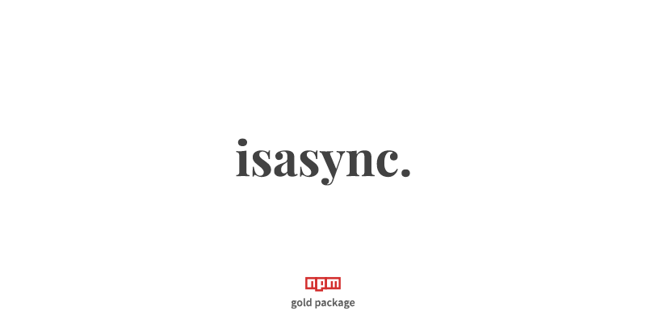

<p align="center">
    <a href="#install" alt="isAsync">
        
    </a>
</p>

<p align="center">
    <a href="https://github.com/nof1000/isclass">isclass</a>
    <strong>&emsp;&bull;&emsp;</strong>
    <a href="https://github.com/nof1000/isarrow">isarrow</a>
    <strong>&emsp;&bull;&emsp;</strong>
    <strong>isasync</strong>
</p>


## What it's for?
This is Node.js library that checks whether a value is an async function


## Install
npm:
```
$ npm install isasync --save
```

yarn:
```
$ yarn add isasync
```


## Example
```js
const isAsync = require('isasync');

console.log(isAsync("hello world")); // > false
console.log(isAsync(function() {})); // > false
console.log(isAsync(async function() {})); // > true
console.log(isAsync(class {})); // > false
console.log(isAsync(() => {})); // > false
console.log(isAsync(async () => {})); // > true
console.log(isAsync(123)); // > false
console.log(isAsync({})); // > false
console.log(isAsync([])); // > false
```


## LICENSE
[MIT](./LICENSE "The MIT License")
